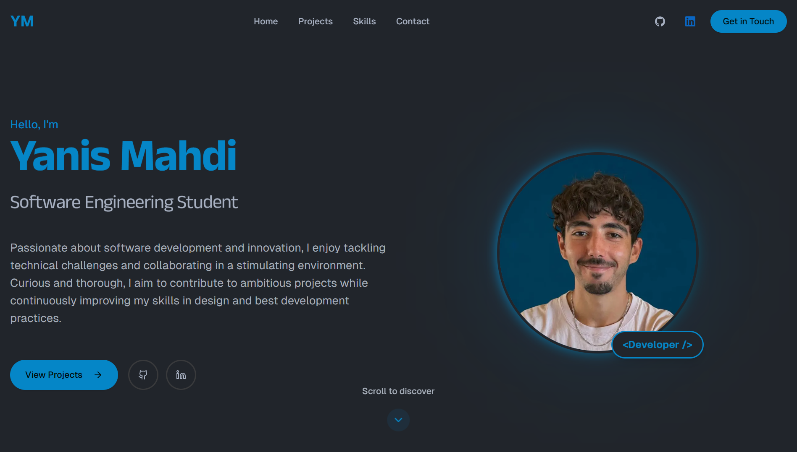

# Yanis Mahdi's Portfolio

**Welcome to my portfolio!**

## 👨‍💻 About Me
Hi, I'm Yanis — a passionate software engineering student with a strong love for coding and technology. This portfolio showcases my projects, contributions, and experiments in software development.  

I enjoy tackling challenging problems, learning new technologies, and building practical solutions. Feel free to explore my work, provide feedback, or reach out if you'd like to collaborate on a project.  

## 🛠️ Built With
This portfolio was built using **React** and **Next.js** with **TypeScript**.  

## 🤝 Contact & Collaboration
I’m always open to discussing new opportunities, contributing to open-source projects, or receiving constructive feedback on my work.  

* **🌐 Website/Portfolio**: [https://yanismahdi.com](https://yanismahdi.com)  
* **📧 Email**: [yanismahdi.net@outlook.fr](mailto:yanismahdi.net@outlook.fr)  
* **🔗 LinkedIn**: [Yanis Mahdi](https://www.linkedin.com/in/mahdi-yanis/)  

Thank you for visiting, and enjoy exploring my projects!  
